#MergeCommonForm
## README
이 클래스는 서로 다른 양식의 비슷한 계측 데이터를 공용 양식으로 통합하는 목적으로 사용합니다.

This class is used for the purpose of integrating similar instrumentation data from different forms into a common form.

## recipe
공용 양식에 대응하는 로컬 데이터의 컬럼 번호 또는 이름을 recipe 파일에 기록합니다.
Writes the column number or name of local data corresponding to the common form to the recipe file.

